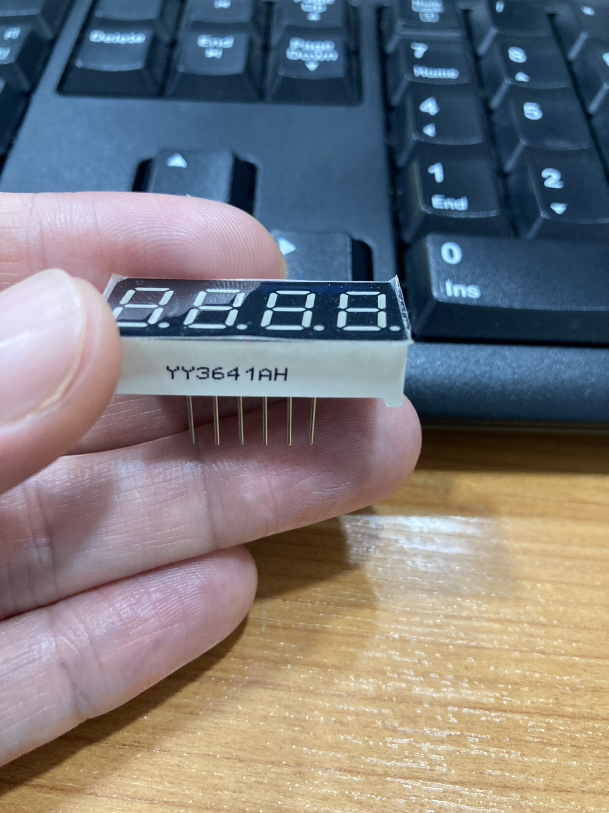
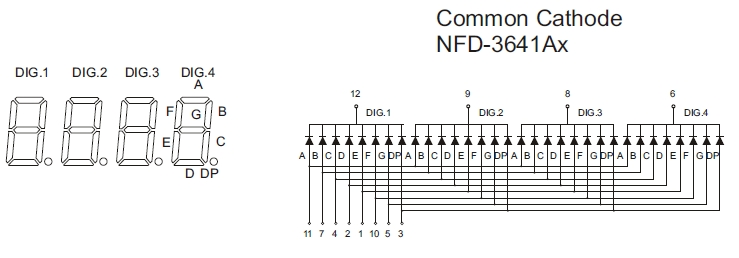
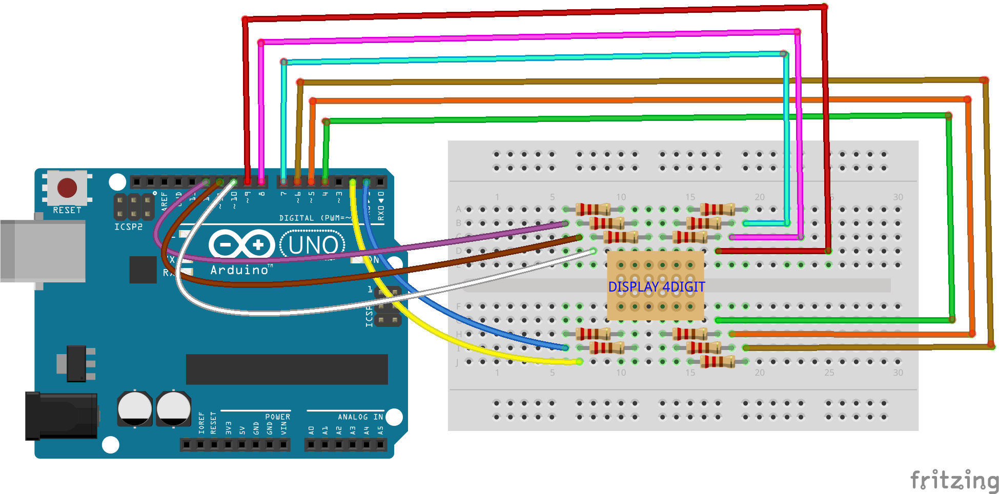

# 7-segment-4-digit
https://youtube.com/shorts/-YFWbYB0UfI 

 
วิธีใช้ให้เราต่อ pin ตรงตาม datasheet ของ 7segment 

  

datasheet4digit 

กรณีอยาก เทสเล่น ๆ สำหรับ cathode   
ต่อ 12 , 9 , 8  และ 6 เข้า gnd 
แล้วจ่ายไฟ 5v ให้พินไหนก็ได้ใน 11,7,4,2,1,10,5,3

 
ถ้าเป็น anode ต้องต่อเข้า 5v 
แล้วขาอีกด้านต่อ gnd
 
อย่าลืมต่อ R 220 ohm นะ ไม่งั้น เสียทันที !!!
 

  

 
จริงๆผมต่อแบบเรียง พิน arduino ตรงกับ พินของหน้าจอเลย 
ตั้งแต่ 1 - 12 ยกเว้น พิน 3

  

